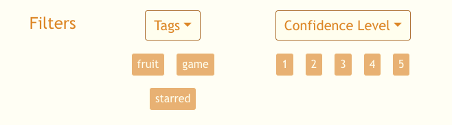

# Scholar Sphere

Flask app that allows the user to study custom created word list with flashcards and interactive games.
Accompanied by an additional chrome extension component that allows users to add words at any time.

## Features

- Chrome extension that allows the user to add word to the study list at any time.
- Alternative option of adding word to the study list by right clicking on a word on the web page.
- Flashcard section that allows the user to select what to show on the front and back of the card, as well as control the order in which the cards are shown with sorting.
- Word list page that allows the user to sort and select which cards to see, with options of seeing a detailed or simple view. Users can futher add word and manage tags there.
- Welcome page, and interactive navigation bar.
- Game page with type in the word game, multiple choice game, and crossword puzzle.

## Demonstration of the Features

### Chrome Extension Popup

### Chrome Extension Context Menu Popup
Right click on the word and select Scholar Sphere to make the popup menu appear.

### Home Page

Navigation bar

### Flashcard Page

Display filters

Word filters
 

Flashcard

### Word List Page

Add word and manage tag expanded view

Word tile detail view

Word simple view

### Game Page

## Technologies Used

- Flask
- JavaScript
- React
- Bootstrap
- HTML
- CSS
